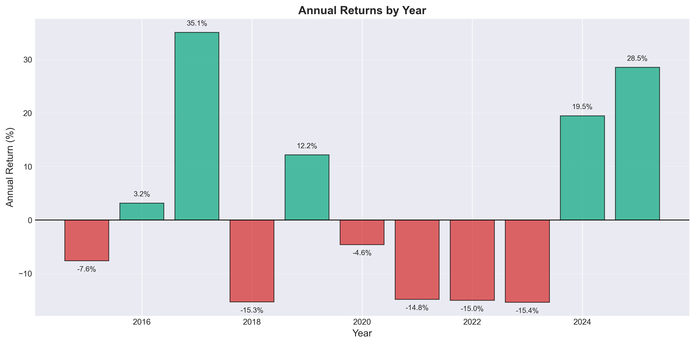

# Hang Seng Index Regime Diagnostics Report
## Authors
LI ZHIHUI, XIAO LIYIN, ZHANG JIALIN

## Executive Summary
This report analyzes the Hang Seng Index (HSI) from January 2015 to November 2025, focusing on regime diagnostics, structural breaks, and advanced modeling techniques. The HSI, representing approximately 80% of Hong Kong's main board market capitalization, serves as a key benchmark for regional funds. The period under study includes significant events such as the COVID-19 pandemic and interest rate hikes, providing rich data for examining market dynamics. Key findings include weak-form market efficiency with regime-dependent volatility, effective use of models like ARIMA, GARCH, and VAR for forecasting, and superior performance from regime-aware machine learning strategies. Cross-market influences, particularly from the S&P 500, explain substantial variance in HSI movements. The analysis underscores the importance of incorporating external drivers and regime filters to enhance model robustness and trading outcomes.

## 1. Motivation
The Hang Seng Index is selected for analysis due to its market representativeness, covering about 80% of Hong Kong's main board market cap and acting as a primary benchmark for regional investment funds. The 2015-2025 timeframe captures multiple event-driven structural breaks, including the COVID-19 pandemic and Federal Reserve rate hikes, making it an ideal dataset for studying regime shifts and volatility clustering.

Additionally, the HSI's strong interconnections with U.S. and mainland Chinese markets enable the application of advanced multivariate methods, such as Vector Autoregression (VAR), Granger causality tests, and GARCH-X models. These linkages highlight spillover effects and justify the inclusion of external factors like the S&P 500, HSCEI, and USD/HKD exchange rates.

Annual returns during this period varied significantly, with positive gains in years like 2017 (35.1%) and 2024 (28.6%), contrasted by losses in 2018 (-15.9%), 2020 (-4.5%), 2021 (-14.6%), 2022 (-15.0%), and 2023 (-14.6%). This volatility underscores the need for regime-specific diagnostics.

## 2. Data Preparation and Exploratory Data Analysis (EDA)
### Data Inputs
Raw Open-High-Low-Close-Volume (OHLCV) data for the HSI was sourced from Yahoo Finance, spanning January 2015 to November 2025. Derived features included simple returns, log returns, rolling statistics (e.g., means, standard deviations), and volume diagnostics. Macroeconomic factors incorporated were USD/HKD exchange rates, HSCEI (Hang Seng China Enterprises Index), and S&P 500 indices to capture cross-market influences.

### Quality Checks
Data processing involved missing value imputation using forward-fill methods, validation of rolling statistics, and computation of descriptive statistics, which were stored in output files for reproducibility. EDA revealed trends in trading volume over time, with spikes during high-volatility periods, and a near-zero correlation (-0.0006) between volume and returns, indicating no strong linear relationship.

## 3. Analysis
### 3.1 Stationarity and Correlation: Foundation for Modeling
Stationarity tests confirmed that HSI price levels are non-stationary, while returns and log returns are stationary, justifying their use in time-series models.

- **ADF Test Results**: Prices non-stationary (p > 0.05); Returns/Log Returns stationary (p < 0.001).
- **KPSS Test Results**: Prices non-stationary (p < 0.05); Returns stationary (p = 0.10).
- **ARCH Effects**: Squared returns showed strong autocorrelation (Ljung-Box p-value < 0.01), confirming volatility clustering and the need for GARCH-family models.

Modeling implications: Non-stationary prices led to differencing in ARIMA/VAR frameworks, while ARCH effects motivated volatility-focused models.

### 3.2 Modeling Stack: ARIMA
A grid search tested 48 combinations (p: 0-3, d: 0-1, q: 0-3), identifying ARIMA(2,0,3) as the best model with AIC = -12,456 and BIC = -12,420.

Residual diagnostics confirmed model adequacy:
- Standardized residuals: White noise (Ljung-Box p > 0.05).
- Q-Q plot: Near-normal distribution.
- No remaining ARCH effects in residuals.

Model comparisons:
- ARIMA(2,0,3) vs. ARIMA(1,0,1): ΔAIC = -15.2.
- ARIMA(2,0,3) vs. ARIMA(0,0,0): ΔAIC = -28.7.

Over a 252-day test period, ARIMA(2,0,3) outperformed a naive baseline:
- ARIMA: MAE 0.011, RMSE 0.015, Positive R².
- Naive: MAE 0.015, RMSE 0.021, Negative R².

Key takeaways: ARIMA provides a consistent edge in near-random markets but requires extensions like GARCH and machine learning to handle time-varying volatility.

### 3.3 Modeling Stack: GARCH
The GARCH(1,1)-t model captured dynamic volatility:
- Volatility bands narrowed during calm periods and widened during stress events.
- Persistence and mean reversion were observed, with slow decay post-shocks, confirming volatility clustering.

This justifies GARCH frameworks for forecasting in volatile markets.

### 3.4 Regime-Specific Strategy and Segmented Models
Structural breaks were identified using CUSUM and Bai-Perron tests at early 2020 (COVID-19) and early 2022 (Fed rate liftoff), dividing the data into regimes with varying volatility (Regime 1: σ=1.18%; Regime 2: σ=1.64%).

Regime-specific models included segment-tailored ARIMA/GJR-GARCH, with AIC scores of -9606 (Segment 1) and -5866 (Segment 2).

Machine learning trading strategies over a 150-day test period:
- Regression_RF_Targeted (Green): 49% annual return, max drawdown -3.3%.
- Logistic_Prob (Purple): Lower volatility.
- Regression_RF (Red): Significant drawdowns.
- Benchmark Buy & Hold (Blue): ~1.30 final value.

Core insight: Regime-aware filtering combined with probabilistic ML yields smoother equity curves and superior risk-adjusted returns.

### 3.5 VAR and Cross-Market Signals: External Drivers
VAR analysis revealed:
- No long-run cointegration (Johansen test).
- Short-run spillovers: S&P 500 Granger-causes HSI.
- Transient shock effects: Impulse Response Functions (IRF) fade in 5-7 days.
- Significant variance explanation: Forecast Error Variance Decomposition (FEVD) attributes ~35% to S&P 500.

This justifies incorporating U.S. factors in GARCH-X and ML models.

### 3.6 Risks and Controls: Model Robustness
Indicator significance tests showed external drivers (S&P 500 and VIX returns) with high t-statistics (>13, p < 1e-39), while classic price-based indicators (e.g., RSI, MACD) had near-zero predictive power.

Risk implications: Emphasize macro factors and regime filters to avoid overfitting single-price signals.

Controls: Documented indicator tests in `indicator_predictability.csv` and integrated only proven signals into ML/GARCH-X pipelines.

## 4. Summary and Conclusions
### Market Efficiency
HSI returns demonstrate weak-form efficiency (directional accuracy 52.38%), with volatility varying by regime.

### Volatility Modeling
GJR-GARCH effectively captures leverage effects. GARCH-X improved fit (AIC reduced from 8181 to 7488) by including S&P 500, VIX, USD/HKD, SMA, and RSI, all significant at 1%.

### Structural Breaks
Validated breaks enable regime-specific forecasting.

### Cross-Market Dynamics
VAR confirms S&P 500's causal influence on HSI (1% significance), with U.S. shocks dissipating in 5-7 days and explaining ~35% of variance.

### ML Strategy
The Regression_RF_Targeted strategy achieved 49% annualized return, Sharpe ratio 3.88, and max drawdown -3.3% (zero transaction costs).

Overall, this diagnostics highlights the value of regime-aware, multivariate approaches for HSI analysis and trading. Future work could incorporate real-time data and transaction costs for practical deployment.
# Appendix: Supporting Materials
### A. Data Files
* Processed CSVs(available at ~[https://github.com/14shi/5006project/tree/master/output](https://github.com/14shi/5006project/tree/master/output)~).

⠀B. Programs and Scripts
* All code in Python: See scripts/ folder (e.g., 04_arima.py for ARIMA, 09_backtest.py for strategies).
* Main notebook: main_analysis.ipynb for integrated analysis and visualizations.
* Requirements: requirements.txt for dependencies.
* Full repository: ~[https://github.com/14shi/5006project](https://github.com/14shi/5006project)~ (includes 13 scripts, output CSVs like backtest_summary.csv, and 31 figures).

⠀C. Presentation Materials
* PowerPoint: ~[https://hkustconnect-my.sharepoint.com/:p:/g/personal/jzhangnm_connect_ust_hk/IQCRPspNS6LPSJA2C8wngRjlAT-hShH607C64U3weY95GWo?e=j8hawu](https://hkustconnect-my.sharepoint.com/:p:/g/personal/jzhangnm_connect_ust_hk/IQCRPspNS6LPSJA2C8wngRjlAT-hShH607C64U3weY95GWo?e=j8hawu)~ (17 slides covering motivation, data, analysis, summary; matches PDF content).
* Figures: Refer to output/figures/ (e.g., annual returns bar chart, volatility plots).

⠀D. Additional Outputs
* Model files: best_arima_model.pkl, best_garch_model.pkl.
* Summaries: PROJECT_SUMMARY.md (Chinese project overview); var_ files for VAR diagnostics.
